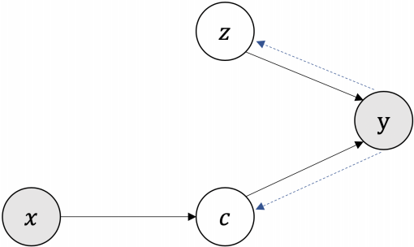

## [Variational Template Machine for Data-to-Text Generation](http://www.openreview.net/pdf?id=HkejNgBtPB)

* A graphical model for generating text $y$ from structured data $x$
* Modifies the Variational Autoencoder by introducing latent variables representing a template $z$ and content $c$
* Represents templates using a continuous latent variable with the intent of generating diverse output
* Reconstruction loss for output given data and template
* Template preserving loss: template variable can reconstruct the text

### [Variational Inference](https://fabiandablander.com/r/Variational-Inference.html)

* Approximation for Bayesian inference with graphical models
* Computing posterior probabilities is hard because of the integration required to compute the evidence probability
* Approximates the posterior distribution using a variational posterior from a family of distributions
* Computing the KL divergence between the approximate and exact posterior would be equally hard, since it depends on the evidence probability
* Minimizing KL divergence is equal to minimizing the negative evidence lower bound (ELBO)
* ELBO is log evidence subtracted from the KL divergence
* The optimization problem is not as hard as integration

## [Meta-Learning with Warped Gradient Descent](http://www.openreview.net/pdf?id=rkeiQlBFPB)

* Model consists of task layers and warp layers
* Task layers are updated using a normal loss
* Meta-learn warp-layers that modify the loss surface to be smoother
* Novelty: non-linear warp layers avoid dependence on the trajectory or the initialization, depending only on the task parameter updates at the current position of the search space

### Meta-Learning

* Learning some parameters of the optimizer such as initialization
* Optimize for the final model accuracy as a function of the initialization
* When using gradient descent, the objective is differentiable
* Backpropagate through all training steps back into the initialization
* Vanishing / exploding gradients when the loss surface is very flat or steep
* Costly—usually scales to a handful of training steps only

## [Transformer-XH](http://www.openreview.net/pdf?id=r1eIiCNYwS)

* Adaptation of Transformer for structured text
* For example, multi-evidence reasoning: answer questions, following words that are linked to Wikipedia
* Extra hop attention attends to the first token of another sequence (representative of the entire sequence)

## [Deep Double Descent](http://www.openreview.net/pdf?id=B1g5sA4twr)

* Bigger model means lower training loss
* At some point test error starts to increase, but with large enough models decreases again
* Occurs across various architectures (CNNs, ResNets, Transformers), data domains (NLP, vision), and optimizer (SGD, Adam)
* Also occurs when increasing training time
* In some cases increasing training data can hurt performance
* Effective model complexity takes training time into account

## [Towards Stabilizing Batch Statistics in Backward Propagation of Batch Normalization](http://www.openreview.net/pdf?id=SkgGjRVKDS)

* Unstable mean and variance estimation with too small batch sizes
* Batch renormalization (BRN): corrects batch mean and variance by moving average
* Moving average batch normalization: moving average of variance mean reduction + weight centralization

## [Compressive Transformer for Long-Range Sequence Modelling](https://openreview.net/pdf?id=SylKikSYDH)

* Train a language model on segments similar to Transformer-XL
* When moving to the next segment, the oldest N activations in the memory are compressed using a compressing function

### Related Work

* Lightweight and Dynamic Convolution: depth-wise separable convolution that runs in linear time
* Transformer-XL: train a language model on segments, but include activations from the previous segment in “extended context”
* Sparse Transformer: sparse attention masks
* Adaptive Attention Span: different attention heads can have longer or shorter spans of attention

## [A Closer Look at Deep Policy Gradients](https://openreview.net/pdf?id=ryxdEkHtPS)

* Policy gradient methods: optimize policy parameters to maximize the expected reward
* Variance reduction using baseline—separate the quality of the action from the quality of the state
* A canonical choice of baseline function is the value function
* Surrogate objective is a simplification of reward maximization used by modern policy gradient algorithms (policy is divided by the old policy, [Schulman et al. 2015](https://arxiv.org/abs/1502.05477))
* Measure of gradient variance: mean pairwise correlation (similarity) between gradient samples
* Visualization of optimization landscapes with different number of samples per estimate
